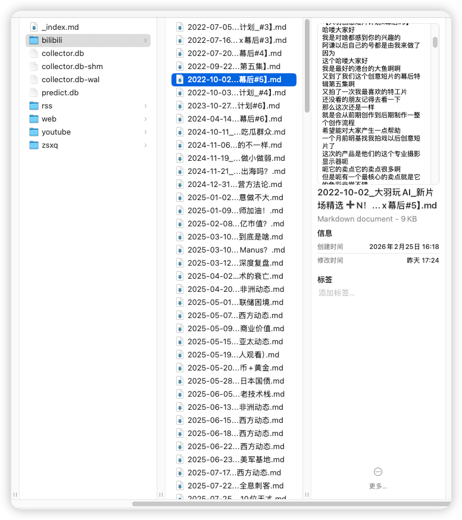
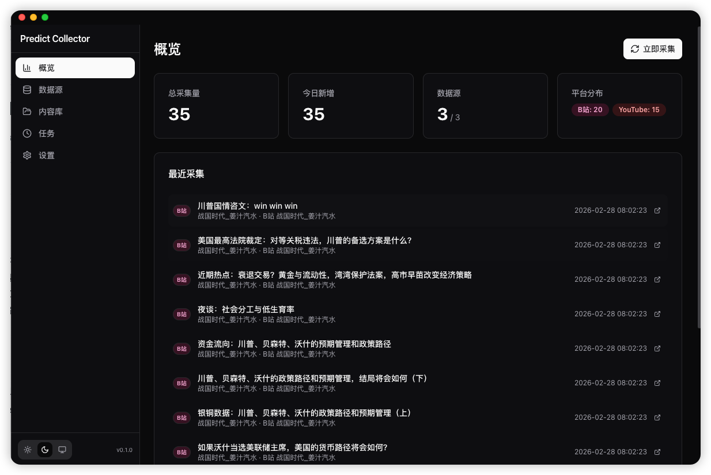
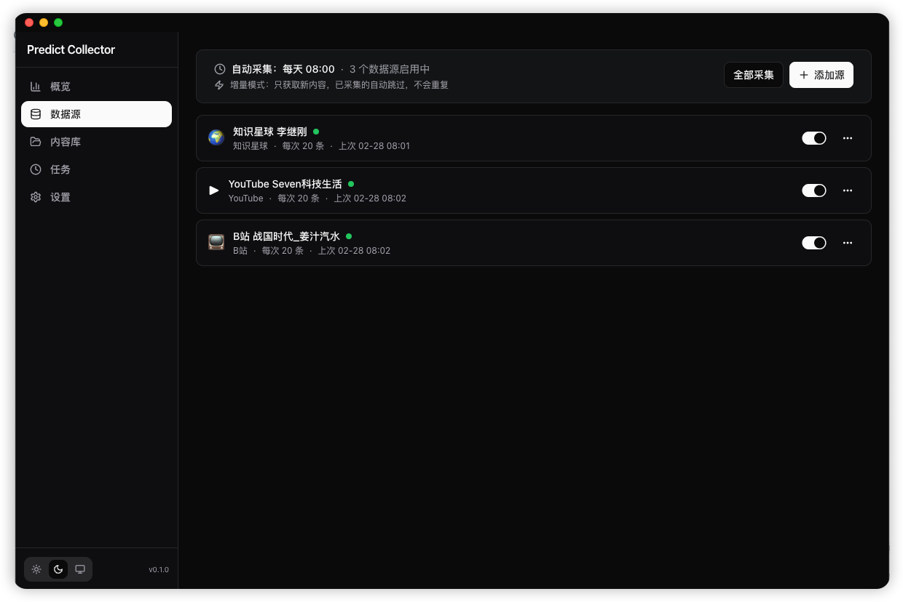
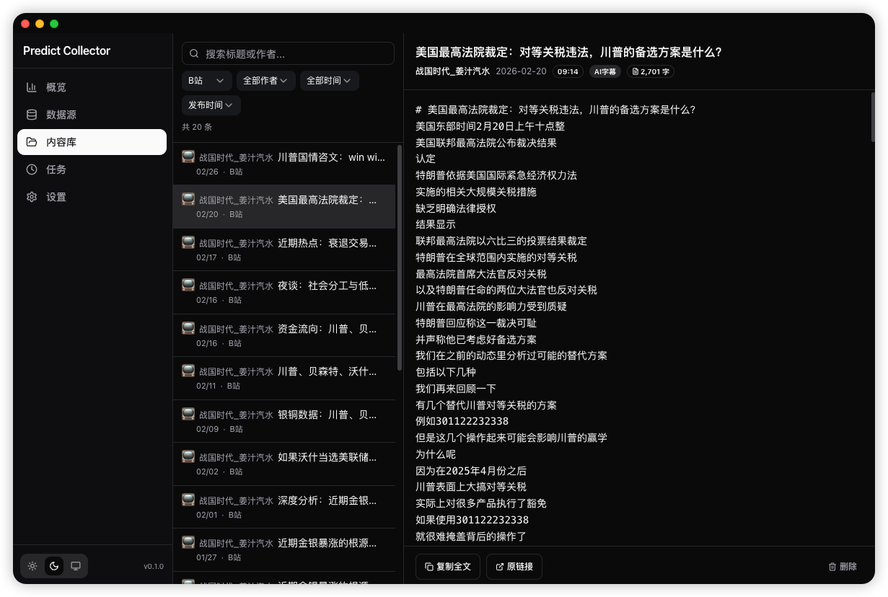
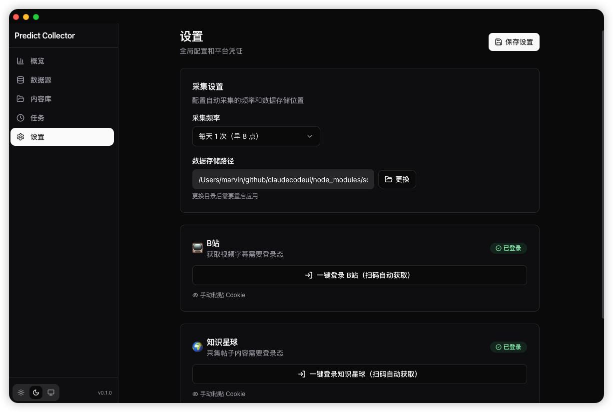

# Data Collector

个人数据基础设施——跨平台统一采集，本地高保真存储。

只做数据的入口和积累，不做数据处理和分析。为AI提供数据基础
**核心**：数据会以md形式高保真存储，方便后续处理处理与AI调用

## 支持的数据源

- **B站** — 关注UP主同步
- **YouTube** — 订阅频道同步
- **知识星球** — 内容同步
- **RSS** — 订阅源抓取
- **网页剪藏** — 任意网页保存

## 应用截图







## 技术栈

Electron + Next.js，本地 SQLite 索引，Markdown 文件存储。

## 安装

### 下载安装

从 [Releases](https://github.com/Marvinngg/datacollector/releases) 下载 DMG（macOS）。

macOS 未签名应用需移除隔离属性：

```bash
xattr -cr /Applications/Data\ Collector.app
```

### 本地开发

```bash
npm install
npm run dev
```
