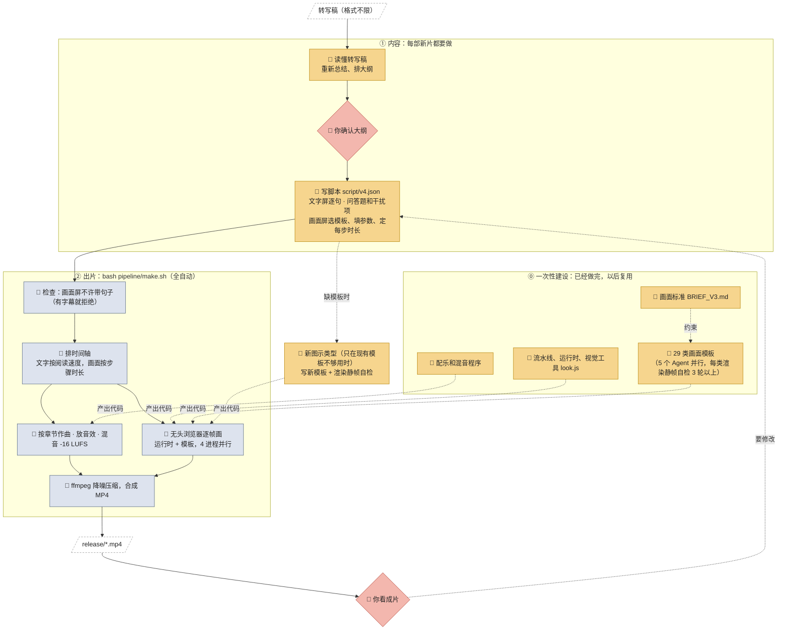

# 工作流：哪些是 AI 的智能，哪些是程序

当前版本是 v4：没有旁白，没有字幕，文字屏和画面屏交替出现。v1 带旁白，流程见文末。

## 四类"处理者"

| 类型 | 定义 | 判断标准 |
|---|---|---|
| 🧠 **Claude 智能** | 需要理解、判断、取舍、创作 | 同样的输入，换个人或换个时间来做，结果可能不一样；做得好不好取决于"想得对不对" |
| 🔧 **专用模型** | 被程序调用的神经网络，只做一件固定的事（仅 v1 用到：配音 ZipVoice、语音识别 SenseVoice） | 有 AI 成分，但不做决定 |
| 📜 **程序** | 写死的代码，按固定规则把输入变成输出 | 同样的输入必然得到同样的输出。每一帧都是时间的纯函数，所以同一份脚本每次渲染出的画面完全一样 |
| 👤 **你** | 提供材料、定方向、拍板 | 确认大纲，看成片 |

需要特别说明两点：
1. **没有任何图片是 AI 生成的**。画面全是程序实时画出来的：字形粒子、光、动画都写在"模板"里。模板是一段会画动画的程序，拿到参数就能画出一整段画面。
2. **模板、运行时、配乐程序本身是 AI 写的代码**。写代码的那一次属于智能；写好以后每次运行，就只是程序。

## 总图



图例：🧠 Claude 智能 · 📜 程序 · 👤 你。实线是每次出片都会走的流程；虚线是一次性写好的代码，或者只在需要时才发生的环节。

## 脚本格式（AI 要写的唯一文件）

脚本由一段一段组成。每段只有两种：

**文字屏**：句子写在 `lines` 里，一句一屏，占满整个画面。
```json
{ "id": "e2b3_a", "lines": ["同时出，谁也看不见谁。", "两个人被分开审讯，各自选：沉默，还是招供。"],
  "visual": { "type": "line" } }
```

**画面屏**：不带句子，只写用哪个模板、参数是什么、每一步持续几秒。
```json
{ "id": "e2b3",
  "visual": { "type": "matrix", "rows": ["沉默","招供"], "cols": ["沉默","招供"],
              "cells": [[["1年","1年"],["10年","放走"]], [["放走","10年"],["5年","5年"]]],
              "steps": [{ "show": "frame", "dur": 2.5 }, { "show": "cells", "dur": 8.5 }] } }
```
画面里需要读的信息写成短标签，比如 step 的 `label`（例：`"乙沉默：招供更好"`）、条目的 `desc`、HUD 数字。完整的句子放在画面前后的文字屏里。一般的顺序是：先用文字屏说明看什么，再放画面，最后用文字屏给结论。

另外还有问答题（`question`：题目、三个选项、答案），以及每集的金句（`remember`）。

## 每个环节的输入和输出

| # | 环节 | 输入 | 处理者 | 输出 | 每部新片都要做？ |
|---|---|---|---|---|---|
| 1 | 总结、大纲 | 转写稿 | 🧠 Claude | 总结和章节大纲（在对话里对齐） | ✅ 是 |
| 2 | 确认 | 总结和大纲 | 👤 你 | 通过或修改意见 | ✅ 是 |
| 3 | 写脚本 | 大纲 | 🧠 Claude | `script/v4.json` | ✅ 是（唯一必须写的文件） |
| 4 | 新图示模板 | 现有模板不够用的段落 | 🧠 Claude | `web/templates/*.js` | 只在需要时 |
| 5 | 字幕检查 | 脚本 | 📜 `gen_timeline.py` | 通过，或报错并指出是哪一段 | 自动 |
| 6 | 时间轴 | 脚本 | 📜 `gen_timeline.py` | `build/timeline.json` | 自动 |
| 7 | 音效节点 | 时间轴 + 模板 | 📜 `render.mjs cues` | `build/cues.json` | 自动 |
| 8 | 配乐 | 时间轴 | 📜 `music.py` → `music_v2.py` | `music.wav` | 自动。换书后如果章节数或情绪变了，要按新章节调整每集的调性表，需要 🧠 |
| 9 | 音效、混音 | 音效节点 + 配乐 | 📜 `sfx.py`、`mix.py` | `mix.wav`（-16 LUFS） | 自动 |
| 10 | 画面 | 时间轴 + 模板 | 📜 `film.js` + `look.js` + `templates/*.js` + 无头浏览器 | `build/video.mp4` | 自动 |
| 11 | 合成 | 画面 + 声音 | 📜 ffmpeg | `release/*.mp4` | 自动 |
| 12 | 审片 | 成片 | 👤 你（🧠 Claude 可以先看缩略图网格自检） | 修改意见 | ✅ 是 |

## 这一部实际花在哪里

| | Claude 智能 | 程序运行 |
|---|---|---|
| **一次性建设** | 流水线、运行时、视觉工具、29 类模板（5 个 Agent）、配乐程序、画面标准 | — |
| **本片内容** | 读转写稿、总结、大纲、写脚本（v2→v3 文字改写，v3→v4 把句子移出画面）、看缩略图审片 | 音频约 8 分钟 + 画面约 50 分钟（4 核、无 GPU） |
| **下一部新片** | 读转写稿、总结、大纲、写脚本；只有出现新类型图示时才写新模板 | 一条命令 `bash pipeline/make.sh` |

## 附：v1（有旁白）的额外环节

`VERSION=1 bash pipeline/make.sh`：配音由 🔧 ZipVoice 完成，📜 数字先转成中文读法。🔧 SenseVoice 听写后，📜 `fix_vo.py` 做拼音比对，读错的句子重录，或换成 `say_candidates.json` 里的备选写法。时间轴按配音的真实时长来排，混音时压低音乐、突出旁白。
