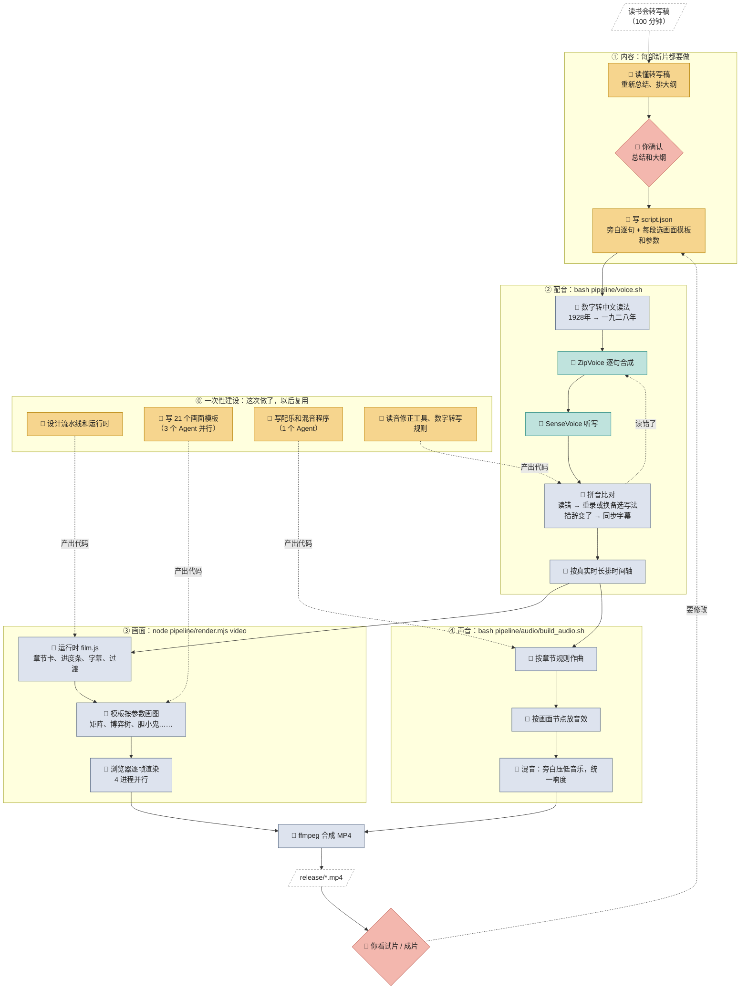

# 工作流：哪些是 AI 的智能，哪些是脚本

## 三类"处理者"怎么区分

| 类型 | 定义 | 判断标准 |
|---|---|---|
| 🧠 **Claude 智能** | 需要理解、判断、取舍、创作 | 同样的输入，换个人或换个时间来做，结果可能不一样；做得好不好取决于"想得对不对" |
| 🔧 **专用模型** | 被脚本调用的神经网络（配音 ZipVoice、语音识别 SenseVoice），只做一件固定的事 | 有 AI 成分，但不做决定：给它一句话，它只负责读出来或听写下来 |
| 📜 **脚本 / 规则** | 写死的程序，按固定规则把输入变成输出 | 同样的输入必然得到同样的输出，不需要任何判断 |
| 👤 **你** | 拍板 | 只在两处确认：总结和大纲、试片（包括声音） |

需要特别说明的一点：**模板和配乐程序本身是 AI 写出来的代码**，写代码的那一次属于智能；写完以后每次运行它，就只是脚本。

## 总图

图例：🧠 Claude 智能 · 🔧 专用模型（被脚本调用）· 📜 脚本或规则 · 👤 你。实线是每次出片都会走的流程；虚线指向的是一次性写好的代码，或者需要返工的环节。

## 每个环节的输入和输出

| # | 环节 | 输入 | 处理者 | 输出 | 每部新片都要做？ |
|---|---|---|---|---|---|
| 1 | 总结、大纲 | 转写稿 | 🧠 Claude | 总结和章节大纲（在对话里） | ✅ 是 |
| 2 | 确认 | 总结和大纲 | 👤 你 | 通过或修改意见 | ✅ 是 |
| 3 | 写脚本 | 大纲 | 🧠 Claude | `script/script.json` | ✅ 是（唯一必须写的文件） |
| 4 | 数字转读法 | 脚本里的旁白 | 📜 `pinyin_match.speakable` | 可以直接朗读的文本 | 自动 |
| 5 | 配音 | 旁白文本 + 音色参考 | 🔧 ZipVoice，由 `gen_vo.py` 调用 | `build/vo/*.wav`（有缓存） | 自动 |
| 6 | 读音核对与修正 | 配音 | 🔧 SenseVoice 听写 + 📜 `fix_vo.py` 拼音比对 | 修好的配音，同步后的字幕 | 自动。偶尔需要 🧠 补充备选写法（`say_candidates.json`） |
| 7 | 时间轴 | 配音时长 + 脚本 | 📜 `gen_vo.py` | `build/timeline.json` | 自动 |
| 8 | 画面 | 时间轴 + 模板 | 📜 `film.js` + `templates/*.js` + 无头浏览器 | `build/video.mp4` | 自动。遇到新类型图示时，需要 🧠 写新模板 |
| 9 | 音效节点 | 时间轴 + 模板 | 📜 `render.mjs cues` | `build/cues.json` | 自动 |
| 10 | 配乐 | 时间轴 | 📜 `music.py`（按章节写死的作曲规则） | `music.wav` | 自动。换书后按新章节调整规则表，需要 🧠 |
| 11 | 音效、混音 | 音效节点 + 配音 + 配乐 | 📜 `sfx.py`、`mix.py` | `mix.wav` | 自动 |
| 12 | 合成 | 画面 + 声音 | 📜 ffmpeg | `release/*.mp4` | 自动 |
| 13 | 审片 | 成片 | 👤 你（🧠 Claude 可以先抽帧自检） | 修改意见 | ✅ 是 |

## 这一部实际花在哪里

| | Claude 智能 | 脚本运行 |
|---|---|---|
| **一次性建设** | 流水线设计、运行时、21 个模板（3 个 Agent）、配乐程序（1 个 Agent）、读音修正工具 | — |
| **本片内容** | 读转写稿、总结、大纲、写脚本、一次性补充少量读音备选写法、抽帧审片 | 配音约 15 分钟 + 修音约 3 分钟 + 音频约 8 分钟 + 画面约 19 分钟 |
| **下一部新片** | 读转写稿、总结、大纲、写脚本；只有出现新类型图示时才要写新模板 | 同上，一条命令 `bash pipeline/make.sh` |
